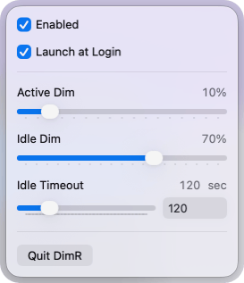

# DimR

DimR is a simple dimming app for macOS, built mainly with OLED screens in mind, but useful for any display if you like having a little more control over brightness and eye comfort.

It keeps things minimal: just a basic overlay with the main focus on idle dimming.

## Features

- Idle dimming after a custom timeout
- Adjustable idle dim amount
- Active dimming for extra eye comfort while you work
- Minimal overlay-based approach
- Launch at login support

## Builds

If you just want to try it, there is a simple app build included here:

 \
[`DimR.app (zip)`](Builds/DimR.zip)

## Support

If you find DimR useful and want to support the project:

[Buy me a coffee](https://buymeacoffee.com/caddaile) \

